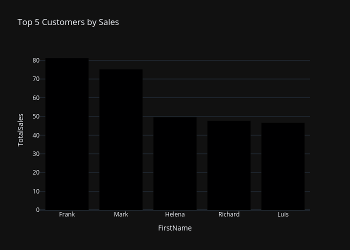

### Question: 
#### Find top 5 customers by sales, plot sales by first name of customer


### Answer


#### Generated SQL
```sql
SELECT c.FirstName, SUM(ii.UnitPrice * ii.Quantity) as TotalSales
FROM customers c
JOIN invoices i ON c.CustomerId = i.CustomerId
JOIN invoice_items ii ON i.InvoiceId = ii.InvoiceId
GROUP BY c.FirstName
ORDER BY TotalSales DESC
LIMIT 5;
```


#### Dataframe
| FirstName | TotalSales |
| --- | --- |
| Frank | 81.24 |
| Mark | 75.24 |
| Helena | 49.62 |
| Richard | 47.62 |
| Luis | 46.62 |


#### Generated Python
```python
import plotly.express as px

if len(df) > 20:
    df = df.head(20)

fig = px.bar(df, x='FirstName', y='TotalSales', title='Top 5 Customers by Sales')
```




